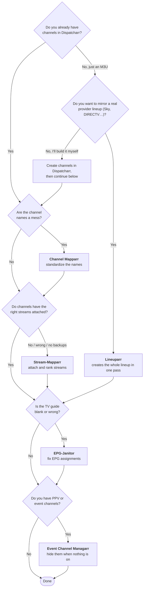

# Which plugins do I need?

There are six plugins here and they genuinely overlap. Four of them do fuzzy name matching, three can change channel visibility, two assign EPG, two assign logos, and two sort streams by quality. That is confusing, and you almost certainly do **not** need all six.

This page exists to tell you which ones to install and which to skip.

## Start here

**IPTV Checker** sits outside this flow. Run it any time you want to know which of your streams are actually dead, ideally *before* Stream-Mapparr so that stream ranking has fresh data to work with.

## Do I need this one?

| Plugin | Install it if… | **Skip it if…** |
| --- | --- | --- |
| [IPTV Checker](workflow/01-iptv-checker.md) | You want dead and low-quality streams identified and tagged. | You do not care about pruning dead streams, or your provider is reliable. |
| [Channel Mapparr](workflow/02-channel-mapparr.md) | Your channel names are inconsistent (`UK: SKY SPORTS F1 FHD`, `Sky Sports F1 HD`). | Your names are already clean, **or you built the lineup with Lineuparr**, which already named them. |
| [Stream-Mapparr](workflow/03-stream-mapparr.md) | Channels have no streams, the wrong streams, or no failover backups. | **You used Lineuparr** and are happy with its matching. (You can still use Stream-Mapparr afterwards purely to re-rank.) |
| [EPG-Janitor](workflow/04-epg-janitor.md) | Your guide shows "No Program Information Available". | Your EPG is clean, or you have no EPG source at all. |
| [Event Channel Managarr](workflow/05-event-channel-managarr.md) | You carry PPV, fight-night, or event channels that sit empty most of the week. | You have no event channels. Most people do not need this. |
| [Lineuparr](lineuparr.md) | You want a real provider's lineup (numbering, groups, logos, EPG) built for you in one action. | You already have a curated lineup you like, or you want fine-grained control at each step. |

### Two more that are not part of the workflow

Neither of these organizes your lineup, and neither is required by anything above. They change nothing in Dispatcharr, so they carry none of the risk the six do.

| Plugin | Install it if… | **Skip it if…** |
| --- | --- | --- |
| [Newsflasharr](supporting/newsflasharr.md) | You want any of the plugins above to email or post their reports. It is the only thing in the suite that delivers a notification, so a report setting elsewhere does nothing without it. | You read the reports as CSV files on disk and want no mail. |
| [Dustarr](supporting/dustarr.md) | You want to know which channels nobody in the house actually watches, so you can cut the lineup down. | You are happy carrying channels you never watch, or you have just built the lineup and have no viewing history yet. |

## Where they overlap

This is the part nobody explains. Several plugins do the same job, and running them in the wrong order makes them fight each other.

| Job | Plugins that do it | Which one should you use? |
| --- | --- | --- |
| **Fuzzy name matching** | Channel Mapparr, Stream-Mapparr, EPG-Janitor, Lineuparr | All four, but they match **different things**. Channel Mapparr matches *your channel* to a *channel database*. Stream-Mapparr matches *streams* to *your channels*. EPG-Janitor matches *your channels* to *EPG entries*. Lineuparr matches *streams* to a *provider lineup*. They are not redundant, they are the same engine pointed at four different problems. |
| **Toggling channel visibility** | Stream-Mapparr, Event Channel Managarr | They will undo each other. Stream-Mapparr's *Manage Channel Visibility* disables every channel with no streams; Event Channel Managarr hides channels with no current event. If you use both, run Stream-Mapparr **first**. See [Scheduling and run order](scheduling.md). |
| **Assigning EPG** | EPG-Janitor, Lineuparr | Lineuparr assigns EPG when it builds the lineup. EPG-Janitor repairs EPG that is missing or broken. Build with Lineuparr, maintain with EPG-Janitor. |
| **Assigning logos** | Channel Mapparr, Lineuparr | Whichever built your channels. Do not run both over the same channels expecting different results. |
| **Sorting streams by quality** | Stream-Mapparr, Lineuparr | Both rank alternates. Stream-Mapparr's is the more capable one (it can rank by *measured* throughput, not just advertised resolution). If you use Lineuparr, you can still run Stream-Mapparr's **Sort Alternate Streams** afterwards. |
| **Finding bad streams** | IPTV Checker | Only one, but note what it is: a **one-shot audit** of every stream in your database. It tells you what was dead *at scan time*. A scan of several thousand streams can take many hours. |

!!! tip "The same knob has different names on different pages"
    **Match Sensitivity** means the same thing in all four matchers, even where the labels differ. It is the minimum similarity score a name has to reach: `Relaxed` = 70, `Normal` = 80, `Strict` = 90, `Exact` = 95. Higher means fewer, safer matches.

    (If a page in this guide says "Loose", it is out of date. The setting is called **Relaxed**.)

    They also all share one escape hatch: when a channel simply refuses to match, define a **Custom Alias** for it. Do not confuse that with **Ignore Tags**, which strips noise like `[FHD]` from names *before* comparing them. That is a different tool for a different problem.

## The one thing everybody gets wrong

Every plugin here can change a lot of rows at once, and several of them **delete** things you might not expect:

- **Stream-Mapparr's Match & Assign replaces a channel's whole stream list**: it does not add to it.
- **Lineuparr's Full Sync deletes channels it could not match.**
- **EPG-Janitor's Strip Hidden EPG deletes program data**, which can blank the guide for other channels sharing that EPG entry.
- **Channel Mapparr's Tag Unknown Channels and logo actions ignore Dry Run Mode** and write immediately.

Each is explained on its own page. Take a backup before your first run of anything, use Dry Run where it exists, and read the danger callout at the top of each page. They are there because these specific behaviours have surprised people.
