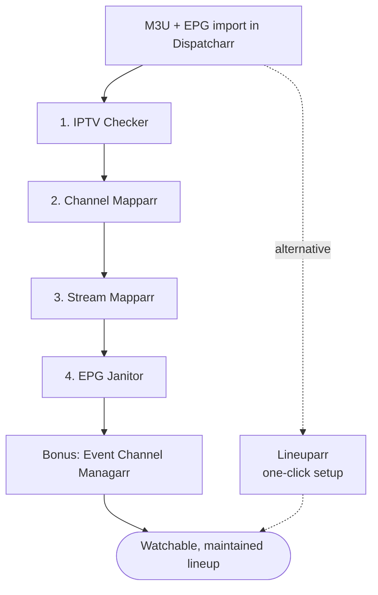
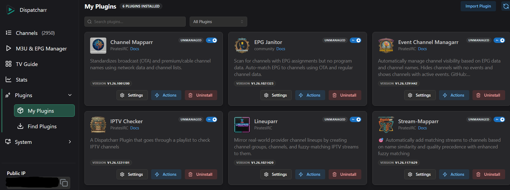

# Dispatcharr Plugin Workflow

A practical, step-by-step workflow for cleaning up your Dispatcharr lineup after M3U and EPG import using the [PiratesIRC](https://github.com/PiratesIRC) plugin suite.

!!! tip "New here? You probably do not need all six plugins."
    They overlap. Four of them do fuzzy name matching, three can change channel visibility, two assign EPG. Start with **[Which plugins do I need?](choosing.md)**, which tells you what each one is for, which to skip, and where they tread on each other's toes.

## What This Is

Dispatcharr does the heavy lifting of streaming IPTV from M3U sources, but the channel list you end up with after import is rarely usable as-is. Stream URLs go dead, channel names are inconsistent across providers, EPG sources disagree with each other, and event channels show stale information. This guide sequences six community plugins by [PiratesIRC](https://github.com/PiratesIRC) into a workflow that gets your lineup from "imported" to "watchable."

If you prefer to automate most of this in a single action and accept less granular control, see the [Lineuparr alternative](lineuparr.md). Lineuparr mirrors a real TV provider lineup (twenty ship with it, including DIRECTV, DISH, Verizon FiOS, Optimum, Spectrum, Sky, Freeview, Canal+, Movistar+, Foxtel, Telus Optik and ODIDO) and handles channel group creation, channel numbering, stream matching, EPG assignment, and logo assignment together. Reach for the workflow in this guide when you need finer control over channel naming, stream selection, EPG repair, or visibility automation.

## The Workflow at a Glance

| Step | Plugin | Purpose |
| :---: | --- | --- |
| 1 | [IPTV Checker](workflow/01-iptv-checker.md) | Probe streams with `ffprobe`; mark dead and low-framerate sources; sync metadata. |
| 2 | [Channel Mapparr](workflow/02-channel-mapparr.md) | Standardize existing channel names against country databases; sort by category. |
| 3 | [Stream Mapparr](workflow/03-stream-mapparr.md) | Fuzzy-match streams to channels; rank alternates by physical quality. |
| 4 | [EPG Janitor](workflow/04-epg-janitor.md) | Find and repair channels with broken EPG assignments. |
| Bonus | [Event Channel Managarr](workflow/05-event-channel-managarr.md) | Toggle visibility of event channels based on EPG state. |
| Alt | [Lineuparr](lineuparr.md) | One-click lineup mirroring real TV providers. |

Two further plugins support that work without being steps in it, and neither changes anything in your lineup:

| Plugin | Purpose |
| --- | --- |
| [Newsflasharr](supporting/newsflasharr.md) | Delivers the reports the other plugins produce, to any of seven destinations. Five of the plugins above send through it. |
| [Dustarr](supporting/dustarr.md) | Records which channels actually get watched and reports the ones that do not. Read-only. |

## Where to Start

1. Read **[Which plugins do I need?](choosing.md)**. The six plugins overlap, and you can probably skip some.
2. Read the [Prerequisites](prerequisites.md), particularly the Channel Profile requirement, which trips up most first-time users.
3. Back up your Dispatcharr database. Several of these plugins delete things: Stream-Mapparr replaces a channel's entire stream list, and Lineuparr deletes channels it could not match. Each page's danger callout spells out what it can destroy.
4. Work the steps in order. Each plugin's output feeds the next plugin's input.
5. When you are happy with the result, see [Scheduling and run order](scheduling.md) to keep it that way, and to avoid the plugins undoing each other.
