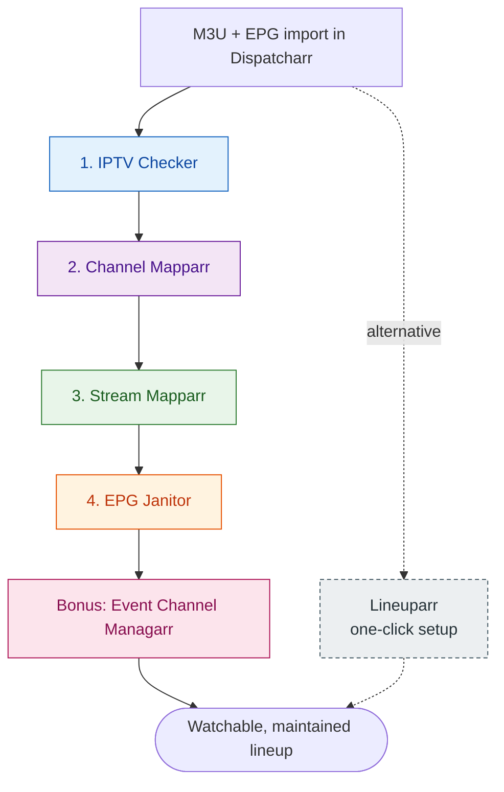

# Dispatcharr Plugin Workflow

A practical, step-by-step workflow for cleaning up your Dispatcharr lineup after M3U and EPG import using the [PiratesIRC](https://github.com/PiratesIRC) plugin suite.

## What This Is

Dispatcharr does the heavy lifting of streaming IPTV from M3U sources, but the channel list you end up with after import is rarely usable as-is. Stream URLs go dead, channel names are inconsistent across providers, EPG sources disagree with each other, and event channels show stale information. This guide sequences six community plugins by [PiratesIRC](https://github.com/PiratesIRC) into a workflow that gets your lineup from "imported" to "watchable."

If you prefer to automate most of this in a single action and accept less granular control, see the [Lineuparr alternative](lineuparr.md). Lineuparr mirrors a real TV provider lineup (DIRECTV, DISH, Sky, Foxtel, Telus Optik, Verizon FiOS, ODIDO) and handles channel group creation, channel numbering, fuzzy stream matching, EPG assignment, and logo assignment together. Reach for the workflow in this guide when you need finer control over channel naming, stream selection, EPG repair, or visibility automation.

## The Workflow at a Glance

| Step | Plugin | Purpose |
| :---: | --- | --- |
| 1 | [IPTV Checker](workflow/01-iptv-checker.md) | Probe streams with `ffprobe`; mark dead and low-framerate sources; sync metadata. |
| 2 | [Channel Mapparr](workflow/02-channel-mapparr.md) | Standardize existing channel names against country databases; sort by category. |
| 3 | [Stream Mapparr](workflow/03-stream-mapparr.md) | Fuzzy-match streams to channels; rank alternates by physical quality. |
| 4 | [EPG Janitor](workflow/04-epg-janitor.md) | Find and repair channels with broken EPG assignments. |
| Bonus | [Event Channel Managarr](workflow/05-event-channel-managarr.md) | Toggle visibility of event channels based on EPG state. |
| Alt | [Lineuparr](lineuparr.md) | One-click lineup mirroring real TV providers. |

!!! info "📸 Screenshot suggestion"
    **File:** `screenshots/dispatcharr-plugins-installed.png`
    **Show:** the Dispatcharr Plugins page with all six plugins installed and enabled. Helps new readers confirm they have the right setup.

## Where to Start

1. Read the [Prerequisites](prerequisites.md) — particularly the Channel Profile requirement, which trips up most first-time users.
2. Back up your Dispatcharr database.
3. Work the steps in order. Each plugin's output feeds the next plugin's input.
