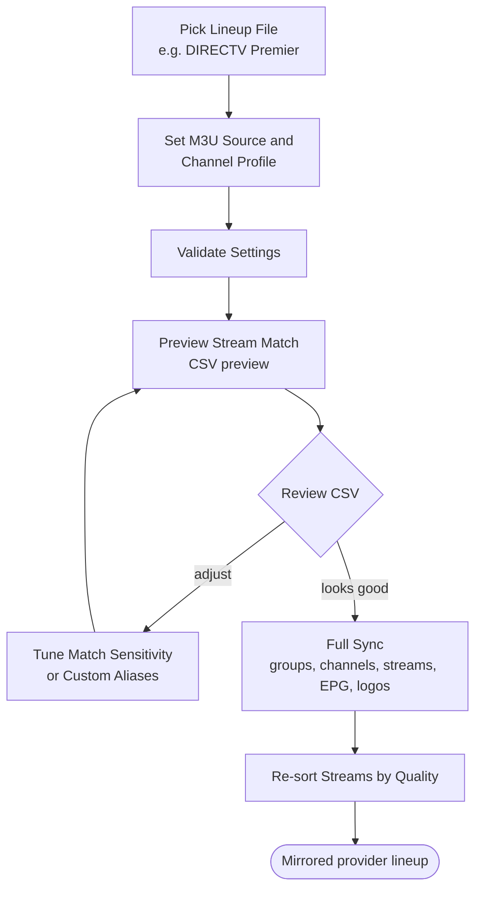
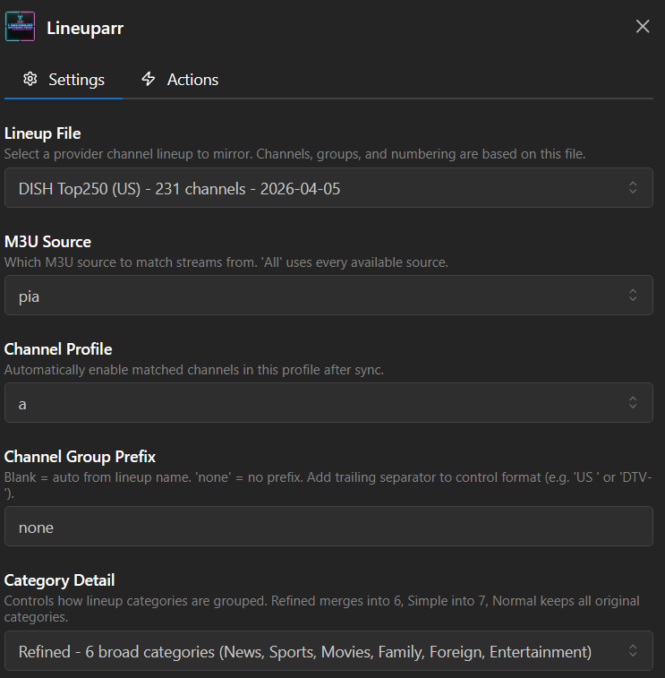

# Alternative: Lineuparr

**Repository:** [Dispatcharr-Lineuparr-Plugin](https://github.com/PiratesIRC/Dispatcharr-Lineuparr-Plugin) &nbsp;  &nbsp; 

## Goal

Mirror a real TV provider's channel lineup in one operation: create channel groups, create channels with the provider's own channel numbering, match streams from your M3U sources, assign EPG, and assign logos. If you would rather not work through the step-by-step workflow in this guide, Lineuparr is the one-shot alternative.

Not sure whether you want this or the step-by-step workflow? See [Which plugins do I need?](choosing.md).

!!! danger "Full Sync DELETES channels it could not match"
    This is the surprise that catches people. In a Lineuparr-managed group, any channel that ends the run with **no streams attached is deleted**. So a lineup channel your M3U cannot supply is not left empty for you to fill in later — it is removed.

    Both **Full Sync** and **Apply Stream Match Only** do this.

    To keep them, set **Preserve Existing Streams** to true. That switches Lineuparr into append mode and turns the unmatched-channel cleanup off.

    [Back up the Dispatcharr database](prerequisites.md#back-up-the-database) before your first run.

!!! warning "Full Sync is not atomic"
    It runs as five sequential steps (groups, channels, streams, EPG, logos). If it fails or is cancelled halfway, you are left with partial state, not a clean rollback. This is the real reason to take a backup first.

## Plugin Flow

## Supported Lineups

Fifteen lineups ship with the plugin. Any extra `*_lineup.json` file you drop in is picked up automatically.

| Lineup file | Package | Country | Channels |
| --- | --- | :---: | :---: |
| `US_DirecTV-Premier_lineup.json` | DIRECTV Premier | US | 351 |
| `US_DISH-Top250_lineup.json` | DISH America's Top 250 | US | 215 |
| `US_Verizon-FIOS_lineup.json` | Verizon The Most Fios TV | US | 202 |
| `US_Combined_lineup.json` | US Combined (DIRECTV + DISH + FiOS) | US | 463 |
| `UK_SkyTV_ENG_full_lineup.json` | Sky TV UK (England) Full | UK | 316 |
| `UK_SkyTV_ENG_simple_lineup.json` | Sky TV UK (England) Simple | UK | 297 |
| `UK_SkyTV_lineup.json` | Sky Ultimate TV | UK | 173 |
| `UK_Freeview_lineup.json` | Freeview UK | UK | 161 |
| `UK_Combined_lineup.json` | UK Combined | UK | 397 |
| `FR_CanalPlus_lineup.json` | Canal+ France | FR | 275 |
| `FR_CanalPlus_TNT_lineup.json` | Canal+ France (TNT numbering) | FR | 275 |
| `ES_Movistar_lineup.json` | Movistar+ | ES | 171 |
| `AU_Foxtel_lineup.json` | Foxtel Platinum Plus | AU | 139 |
| `CA_Telus-Optik_lineup.json` | TELUS Optik TV Ultimate | CA | 128 |
| `NL_ODIDO_lineup.json` | ODIDO | NL | 153 |

## Configuration Options

- **Lineup File:** Default `US_DirecTV-Premier_lineup.json`. Pick the file for the provider you want to mirror.
- **M3U Source:** The M3U source whose streams are matched against the lineup's channels.
- **Channel Profile:** Default `_none`. This does **not** decide where channels are created — they are always created in the Lineuparr groups. It only decides which profile the matched channels are *enabled* in afterwards.
- **Channel Group Prefix:** Blank does **not** mean "no prefix" — blank auto-derives one from the lineup name. To suppress it entirely, type the literal word `none`. Include your own trailing separator to control the format (for example `US ` or `DTV-`).
- **Category Detail:** Default `Normal`. How granular the auto-created groups are.
- **Match Sensitivity:** Default `Normal`. Relax it if streams are not matching; tighten it to reduce false positives. On a multi-country M3U, use **Strict**.
- **Channel Numbering:** Default `Use Channel Database Numbers` — the provider's real channel numbers.
- **Starting Channel Number:** Only applies in **Use Specific Number** mode. It is ignored in the other numbering modes.
- **Order Matched Streams by Quality:** Default true. Sorts alternate streams by resolution and FPS.
- **Preserve Existing Streams:** Default **false**. Set it to **true** to append rather than replace, and to stop unmatched channels being deleted. The most safety-relevant setting on this page.
- **Quality-Aware Stream Matching:** Default false. Keeps e.g. `TF1` and `TF1 UHD` in their own quality tiers instead of matching across them.
- **Refresh EPG After Match:** Default **true**. Triggers a Dispatcharr EPG refresh once EPG matching finishes.
- **Single Channel Match:** Scope Preview, Apply Stream Match, Apply EPG and Assign Logos to one channel by name. **Full Sync ignores it.**
- **Rate Limiting:** Default `None`. Raise it if Dispatcharr returns errors during long runs.
- **Custom Channel Aliases (JSON):** Manual overrides for channels whose stream name does not match. Define the override once and Full Sync respects it on every run.
- **EPG Sources for Matching:** A free-text field, **not** a dropdown. Blank = every source. Otherwise a comma-separated list supporting `*` / `?` wildcards (for example `UK*`), where **sources listed earlier win**.

!!! warning "Matching reads the stream name only, never its group"
    A common misconception. Putting a stream in the right group does not help it match — only the stream's *name* is compared. On a multi-country M3U this is why a Spanish channel can match a UK one; use **Strict** sensitivity and lineup-appropriate M3U sources.

## Action Sequence

1. Pick a **Lineup File**, **M3U Source**, and **Channel Profile**.
2. Run **Validate Settings** to confirm the lineup file loads, the M3U source is reachable, and the profile exists.
3. Run **Preview Stream Match** to see how your streams match the lineup's channels. Review the CSV. Nothing is written.
4. Decide about **Preserve Existing Streams** before step 5 — see the danger note at the top.
5. Run **Full Sync** to create groups and channels, assign streams, EPG and logos in one pass.
6. Or run the partial actions instead, for finer control:
    - **Sync Channels Only** — create groups and channels, touching no streams, EPG or logos.
    - **Apply Stream Match Only** — match streams to existing channels. **Also deletes unmatched channels.**
    - **Apply EPG Match** — assign EPG only.
    - **Assign Logos** — apply logos only.
7. Run **Re-sort Streams by Quality** to re-rank the alternates on each channel.
8. Use **Show Status** to check on a running job or see the last result, and **Clear CSV Exports** to clean up old previews.

## Important Notes

- **Requires Dispatcharr v0.20.0+** and at least one M3U source.
- Lineuparr is an alternative to the [main workflow](index.md), not a replacement for the individual plugins. You can run Lineuparr first and still use the per-plugin steps for fine-tuning afterwards — Stream-Mapparr's quality re-ranking, EPG-Janitor's heal pass. See [Which plugins do I need?](choosing.md) for how they overlap.
- Custom Channel Aliases is the escape hatch when matching fails for a specific channel.
