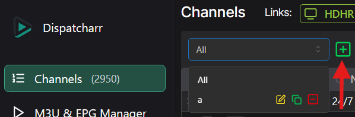

# Prerequisites

These plugins assume Dispatcharr already has channels in your lineup and at least one **Channel Profile other than "All"** is set up. Channels are typically auto-created during M3U import or built holistically by the Lineuparr Plugin. None of the plugins in this guide create channels from scratch — they organize, validate, map streams to, repair EPG on, or toggle visibility for channels that already exist.

## Channel Profile Requirement

The Channel Profile requirement is strict: Stream-Mapparr will refuse to run against the default "All" profile, and Event Channel Managarr requires you to specify a profile name.

If you have not created one, see the Dispatcharr documentation on [Channel Profiles](https://dispatcharr.github.io/Dispatcharr-Docs/channels/?h=channel#channels) — open the Channel Profile drop-down on the Channels page and click the icon next to it to create a new profile.

## Back Up the Database

Several plugins make bulk changes that cannot be undone. Back up the Dispatcharr database before running any of them. Backup instructions are in the [Dispatcharr troubleshooting docs](https://dispatcharr.github.io/Dispatcharr-Docs/troubleshooting/?h=backup#how-can-i-make-a-backup-of-the-database).

## API Credentials

Modern Dispatcharr releases give plugins direct database/ORM access — there is no longer a need to configure a Dispatcharr URL, username, or password in any of these plugins. If your plugin still shows credential fields, update the plugin to its current release.
