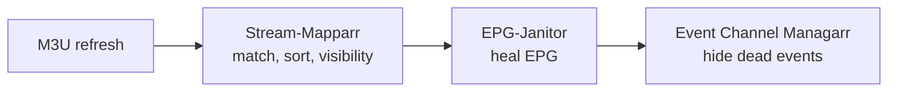

# Scheduling and run order

Once the lineup is clean, you want it to *stay* clean without doing this by hand every week. This page covers what to run, how often, and — the part that bites people — what order to run things in so the plugins do not undo each other.

## Run order matters

!!! danger "Stream-Mapparr and Event Channel Managarr will fight over channel visibility"
    Both toggle channels on and off, using different criteria.

    - **Stream-Mapparr's Manage Channel Visibility** disables every channel in the profile, then re-enables the ones that have at least one stream.
    - **Event Channel Managarr** hides channels that have no event on right now.

    If Event Channel Managarr runs first and hides an empty PPV channel, and Stream-Mapparr then runs and sees that the channel *does* have a stream attached, it turns it straight back on.

    **Always run Stream-Mapparr before Event Channel Managarr.** If you schedule both, leave enough of a gap that the first has finished before the second starts.

The safe daily order is:

IPTV Checker sits outside the daily loop — it is slow, and Stream-Mapparr only needs its results to be *reasonably* fresh.

## Suggested cadence

| Plugin | How often | Notes |
| --- | --- | --- |
| **IPTV Checker** | Weekly, overnight | A full scan of several thousand streams can take many hours. Window it so it is not running while people are watching. |
| **Stream-Mapparr** | Daily, or after each M3U refresh | Has a built-in scheduler, and can also trigger itself automatically on M3U refresh (see below). |
| **EPG-Janitor** | As needed | **No scheduler.** Every action is manual. |
| **Event Channel Managarr** | Every few hours | Event channels turn over through the day. Also set **Auto-rescan after M3U refresh**, or Dispatcharr's Auto Channel Sync will un-hide everything on the next refresh. |
| **Channel Mapparr** | Rarely | Run it when you add a provider or your names drift. It has no scheduler. |
| **Lineuparr** | Rarely | Re-run when the provider's lineup changes. |

## Three plugins, three different time formats

This catches everyone. There is no single scheduling format across the suite.

| Plugin | Format | Example | Time zone used |
| --- | --- | --- | --- |
| **IPTV Checker** | cron | `0 3 * * 0` | Its own setting |
| **Stream-Mapparr** | `HHMM`, comma-separated | `0400,1600` | Dispatcharr's **global** Time Zone |
| **Event Channel Managarr** | `HHMM`, comma-separated | `0600,1200,1800` | Dispatcharr's **global** Time Zone |
| **EPG-Janitor** | *(no scheduler)* | — | — |
| **Channel Mapparr** | *(no scheduler)* | — | — |

!!! warning "HHMM means HHMM"
    Stream-Mapparr and Event Channel Managarr accept **`0400`**, not `04:00`. A value with a colon is silently ignored — the schedule simply never fires, with no error to tell you why.

!!! note "The per-plugin Timezone settings are gone"
    Stream-Mapparr and Event Channel Managarr both used to have their own Timezone field. They now follow **Dispatcharr's global Time Zone** (Settings → General). If that is unset, Event Channel Managarr falls back to UTC. Set the global time zone correctly and everything lines up.

## Automating on M3U refresh instead of on a clock

The tidiest setup skips fixed times altogether and reacts to your M3U refresh, so work happens exactly when there is new data to process. Both settings need Dispatcharr v0.27+.

- **Stream-Mapparr → Auto-match after M3U refresh** — runs Match & Assign as soon as a refresh completes.

    !!! warning
        Remember that Match & Assign **replaces** each matched channel's stream list. Turning this on means that runs unattended after every refresh. Only enable it once you are happy with what a manual run produces.

- **Event Channel Managarr → Auto-rescan after M3U refresh** — re-hides event channels that Dispatcharr's Auto Channel Sync just un-hid.

## Before you automate anything

Run each plugin by hand at least once, with Dry Run enabled where it exists, and read the danger callout on its page. Several of these actions delete things — see [Which plugins do I need?](choosing.md#the-one-thing-everybody-gets-wrong) for the short list. Automating a destructive action you have not watched run once is how people lose their lineup.
