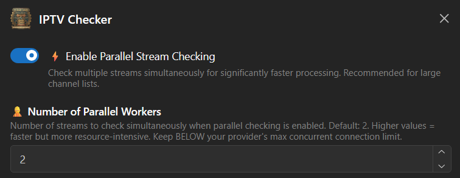
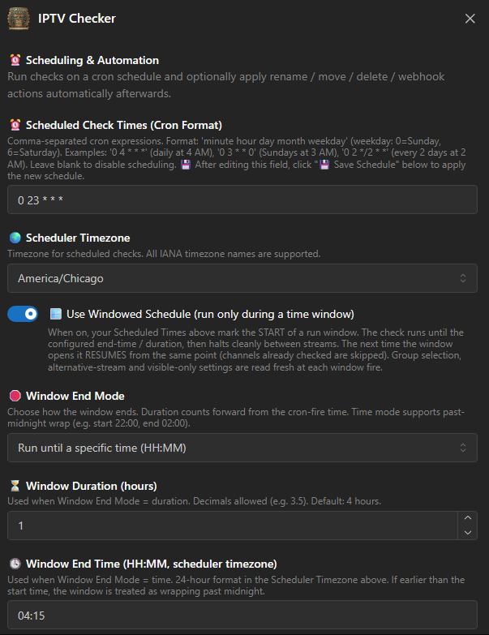

# 1. Stream Verification — IPTV Checker

**Repository:** [Dispatcharr-IPTV-Checker-Plugin](https://github.com/PiratesIRC/Dispatcharr-IPTV-Checker-Plugin)

## Goal

Probe each stream with `ffprobe`, mark dead or low-framerate sources, and sync technical metadata (codecs, resolution, bitrate, FPS) back into the Dispatcharr database. The metadata gathered here is what Stream-Mapparr later uses to rank stream quality and filter out broken sources.

!!! danger "Back up your database first"
    This plugin makes bulk changes that cannot be undone. [Back up the Dispatcharr database](../prerequisites.md#back-up-the-database) before running any actions.

## Plugin Flow


## Configuration Options

- **Groups to Check:** Comma-separated group names; empty = all groups. Wildcards supported (e.g., `US-*`, `*Sports*`).
- **Check Alternative Streams:** Probe every backup stream attached to a channel, not just the primary.
- **Connection Timeout** (default 10s), **Probe Timeout**, and **Dead Connection Retries** (default 3).
- **Per-Stream Cooldown** to avoid hammering a single host.
- **FFprobe Analysis Flags** and **FFprobe Analysis Duration** for tuning probe behavior on slow streams.
- **Streamlink-Only Hosts:** Comma-separated host patterns probed via `streamlink` instead of direct `ffprobe`.
- **Dead Channel Rename Format** and **Move Dead Channels to Group** (default `Graveyard`).
- **Low Framerate Rename Format** and **Move Low Framerate Group** (default `Slow`).
- **Video Format Suffixes:** Default `UHD, FHD, HD, SD, Unknown`.
- **Enable Parallel Checking** with **Number of Parallel Workers** for faster scans.
- **FFprobe Path:** Default `/usr/local/bin/ffprobe`.
- **Delete Dead Channels** with **Auto-Delete Confirmation** for fully removing dead channels rather than just renaming them.
- **Webhook URL** and **Send Webhook Notification** to fire an external notification when a check completes.
- **Enable Scheduled Checks**, **Scheduled Check Times** (cron syntax), **Scheduler Timezone**, **Export CSV for Schedule**.
- **Use Windowed Schedule** with **Window End Mode**, **Window Duration**, **Window End Time**, and **Reset Window Progress** for time-bounded scans that pick up where they left off.



## Action Sequence

1. Save scan preferences.
2. Run **Validate Settings** to confirm `ffprobe` path and configuration.
3. Run **Load Group(s)** to pull the channel list. Large lists load in the background.
4. Run **Start Stream Check**. The scan runs in a background thread and survives browser timeouts.
5. Monitor with **View Check Progress** for live ETA, then **View Last Results** or **View Results Table** when finished.
6. Optionally run **Rename Dead Channels**, **Move Dead Channels to Group**, **Rename Low Framerate Channels**, or **Add Video Format Suffix**.
7. Export with **Export Results to CSV**. Use **Clear CSV Exports** to clean up old exports.
8. Use **Cancel Stream Check** to stop a running scan, **Cleanup Orphaned Tasks** to clear stale Celery entries, or **Check Scheduler Status** to verify scheduled runs.

## Important Notes

!!! warning "Plan for hours, not minutes"
    A single-threaded check can take **24 hours on ~6,000 streams**. Even with parallel workers, large catalogs commonly run for several hours. Schedule the plugin rather than running it interactively.

### Recommended approach for large catalogs

- **Use the scheduler.** Enable **Scheduled Checks** with a cron time during your low-traffic hours rather than triggering scans manually. The scheduler also survives Dispatcharr restarts. If cron syntax is unfamiliar, build the expression interactively at [crontab.guru](https://crontab.guru/) — for example, `0 3 * * *` runs once a day at 3 AM.
- **Tune parallel workers.** If your IPTV provider allows N concurrent connections, set **Number of Parallel Workers** to roughly **half of N**. Going higher risks the provider rate-limiting or banning your account; going much lower wastes time.
- **Consider Windowed Scheduling** for very large catalogs. The plugin will pick up where it left off on the next window, so a multi-day scan does not need to complete in one sitting.

### Watching progress

If the browser tab is open, **View Check Progress** gives a live ETA. If you closed the tab or the browser timed out, watch the container logs:

```bash
docker logs -f dispatcharr | grep "IPTV-Checker"
```

Wait for `✅ COMPLETED` in the log before queuing the next action — the UI button re-enabling does not always mean the scan finished.

### Other notes

- Metadata syncing happens automatically during the check and feeds Stream-Mapparr's quality ranking and dead-stream filtering.
- Run this plugin first so downstream plugins have accurate stream data to work with.
- The standard Dispatcharr container ships with `ffmpeg`, `ffprobe`, and `pytz` already installed — no manual setup is needed.


