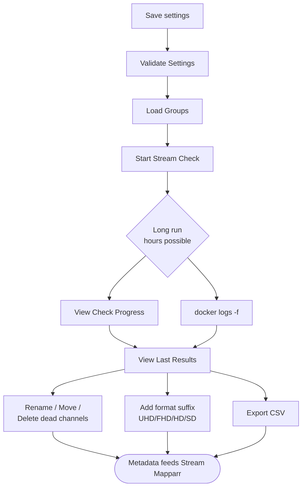

# 1. Stream Verification: IPTV Checker

**Repository:** [Dispatcharr-IPTV-Checker-Plugin](https://github.com/PiratesIRC/Dispatcharr-IPTV-Checker-Plugin) &nbsp; [](https://deepwiki.com/PiratesIRC/Dispatcharr-IPTV-Checker-Plugin) &nbsp; [](https://discord.gg/Sp45V5BcxU)

## Goal

Probe each stream with `ffprobe`, mark sources that are dead, low-framerate, or broken in a way that still answers the probe, and sync technical metadata (codecs, resolution, bitrate, FPS) back into the Dispatcharr database. The metadata gathered here is what Stream-Mapparr later uses to rank stream quality and filter out broken sources.

!!! danger "Back up your database first"
    This plugin makes bulk changes that cannot be undone. [Back up the Dispatcharr database](../prerequisites.md#back-up-the-database) before running any actions.

## Plugin Flow



## Configuration Options

- **Channel Groups:** Comma-separated group names; empty = all groups. Wildcards supported (`*`, `?`, and `[abc]`). Matching is case-sensitive.
- **Channel Groups Mode:** Decides whether that list names the groups to check or the groups to skip. Skip mode is the one to use for pay-per-view and event groups, and it also picks up any group you create later, whereas a list of groups to check leaves a new group out until you add it. Either mode checks everything when the box is empty. This replaced the older separate *Group(s) to Check* and *Group(s) to EXCLUDE* settings, and values from those are read until you save this one.
- **Check Alternative Streams:** Probe every backup stream attached to a channel, not just the primary.
- **Only Check Visible Channels:** Skip channels that are disabled in every Channel Profile, or assigned to none.
- **Connection Timeout** (default 10s), **Probe Timeout**, and **Dead Connection Retries** (default 3).
- **Per-Stream Cooldown** to avoid hammering a single host.
- **FFprobe Analysis Flags** and **FFprobe Analysis Duration** for tuning probe behavior on slow streams.
- **Streamlink-Only Hosts:** Comma-separated host patterns probed via `streamlink` instead of direct `ffprobe`.
- **Dead Channel Rename Format** and **Move Dead Channels to Group** (default `Graveyard`).
- **Blank-Screen Channel Rename Format** and **Move Blank-Screen Channels to Group** (default `Black Screens`).
- **Low Framerate Rename Format** and **Move Low Framerate Group** (default `Slow`).
- **Email Report After Scheduled Check:** Hands the results to the separate [Newsflasharr](../supporting/newsflasharr.md) plugin, which is what actually delivers them. The older **Webhook URL** and **Send Webhook Notification** settings are gone: notification delivery is Newsflasharr's job now, and it covers webhooks along with six other destinations.
- **Video Format Suffixes:** Default `UHD, FHD, HD, SD, Unknown`.
- **Enable Parallel Checking** with **Number of Parallel Workers** for faster scans.
- **FFprobe Path:** Default `/usr/local/bin/ffprobe`.
- **Delete Dead Channels** with **Auto-Delete Confirmation** for fully removing dead channels rather than just renaming them.
- **FFmpeg Path:** Default `/usr/local/bin/ffmpeg`. Used by the blank-screen, frozen-video and silent-audio checks.
- **Scheduled Check Times (Cron Format):** One or more cron expressions. **There is no separate "Enable Scheduled Checks" switch and no per-plugin timezone setting**, and earlier versions of this guide were wrong to list either. A non-empty expression is what turns scheduling on, blank turns it off, and the times are read in **Dispatcharr's own Time Zone** (Settings, then General), falling back to UTC if that cannot be read. After editing the field, click **💾 Save Schedule**: saving the form on its own does not re-arm the scheduler.
- **Use Windowed Schedule** with **Window End Mode**, **Window Duration** and **Window End Time**, for time-bounded scans that pick up where they left off. **🔄 Reset Progress** is an action, not a setting: it discards the saved position so the next window starts from the beginning.
- **Delete CSV Exports Older Than (Days):** Default **0, which keeps everything**, so nothing is deleted unless you ask for it. It runs after each export and only ever removes this plugin's own `iptv_checker_results_*.csv` files, never another plugin's, never the file it just wrote, and never the last surviving one.

!!! warning "Several cron expressions are separated by a semicolon, not a comma"
    A comma is already meaningful *inside* a cron field, where it lists values, so `0 0,8,16 * * *` is one expression meaning midnight, 8 AM and 4 PM. To run two *different* expressions, separate them with a semicolon: `0 4 * * * ; 0 3 1 * *`.

    An expression that could never fire is now refused when you save it, with a message naming what is wrong. Version `1.26.2481600` closed off a set of schedules that used to be accepted, reported as saved, and then silently never run: an out-of-range hour, day names such as `SUN,TUE`, quotation marks around the expression, a trailing comma, or spaces after the commas in a day list. Saving a valid schedule now also prints back what it means in words, such as `Sun, Tue and Thu at 10:00 PM`, so you can check it says what you intended. **Day of week 7 now means Sunday**, as in standard cron; it previously matched nothing.

### Finding streams that answer but are not watchable

A stream can pass `ffprobe` perfectly and still be useless: a black picture, a still frame, no sound, or a short file looping. Four optional checks catch those. **All four are off by default**, because the first three cost decode time on every stream.

- **Detect Blank-Screen Streams:** Decodes a few seconds with ffmpeg's `blackdetect` filter and marks all-black streams Dead under the `Black Screen` error type. Tuned by **Blank-Screen Sample** (default 6 seconds of video decoded), **Continuous Blank Required** (default 3 seconds, which should stay a few seconds below the sample so connection and keyframe latency do not eat the whole window), and **Blank-Screen ffmpeg Timeout** (default 20 seconds wall clock, after which the stream is left Alive rather than guessed at).
- **Detect Frozen-Video Streams:** Checks the same decoded sample for a continuous run of identical frames. **Frozen-Video Minimum** (default 4 seconds) is automatically reduced to fit inside the sample, because a value at or above the sample length could never be reached.
- **Detect Silent-Audio Streams:** Measures the mean volume of the decoded sample and marks anything at or below **Silence Threshold** (default -70 dBFS) as Dead. Streams with no audio track at all are skipped, since they cannot be silent. The default sits between digitally silent audio, which measures about -91 dB, and the quietest real channel measured at about -44 dB.
- **Detect Placeholder-File Streams:** Marks any stream reporting a fixed container duration as Dead under the `Placeholder File` error type. A live stream has no fixed duration, so this is a strong signal, and it **adds no probe time at all**. If you enable only one of these four, make it this one.

Blank-screen channels get their own rename format and destination group (**Blank-Screen Channel Rename Format**, **Move Blank-Screen Channels to Group**), and are deliberately excluded from the Dead rename and move actions so they are not tagged twice.

### Scheduled runs can act on their own results

A cron schedule on its own only performs the scan. Each follow-up action has its own switch that decides whether the scheduled run also applies it, so an unattended scan can rename, move, delete, tag and email without you present:

- Renaming: **Rename Dead Channels**, **Rename Blank-Screen Channels**, **Rename Low Framerate Channels**, **Add Video Format Suffix**.
- Moving: **Move Dead Channels**, **Move Blank-Screen Channels**, **Move Low Framerate Channels**.
- Other: **Restore Recovered Channels**, which un-tags channels that have come back to life, and **Email Report After Scheduled Check**.

!!! danger "Delete Dead Channels After Scheduled Checks removes channels unattended"
    This one deletes rather than renames, on a schedule, with nobody watching. It is gated behind **Auto-Delete Confirmation**, which you must set to the literal word `DELETE` before it will do anything. Treat that gate as the safety feature it is, and make sure your database backups actually run before you arm it.


## Action Sequence

1. Save scan preferences.
2. Run **Validate Settings** to confirm `ffprobe` path and configuration.
3. Run **Load Group(s)** to pull the channel list. Large lists load in the background.
4. Run **Start Stream Check**. The scan runs in a background thread and survives browser timeouts.
5. Monitor with **View Check Progress** for live ETA, then **View Last Results** or **View Results Table** when finished.
6. Optionally run **Rename Dead Channels**, **Move Dead Channels to Group**, **Rename Low Framerate Channels**, or **Add Video Format Suffix**. If you enabled blank-screen detection, **Rename Blank-Screen Channels** and **Move Blank-Screen Channels to Group** handle those separately.
7. Run **Restore Recovered Channels** to un-tag channels that were previously marked and now probe clean again. Without it, a channel that recovers keeps its dead-channel name.
8. Export with **Export Results to CSV**. Use **Clear CSV Exports** to clean up old exports. **Email Report** sends the results if you have mail configured.
9. Use **Cancel Stream Check** to stop a running scan, **Cleanup Orphaned Tasks** to clear stale Celery entries, or **Check Scheduler Status** to verify scheduled runs.

## Important Notes

!!! warning "Plan for hours, not minutes"
    A single-threaded check can take **24 hours on ~6,000 streams**. Even with parallel workers, large catalogs commonly run for several hours. Schedule the plugin rather than running it interactively.

### Recommended approach for large catalogs

- **Use the scheduler.** Put a cron expression in **Scheduled Check Times** for your low-traffic hours rather than triggering scans manually, then click **💾 Save Schedule**. The scheduler survives Dispatcharr restarts. If cron syntax is unfamiliar, build the expression interactively at [crontab.guru](https://crontab.guru/): for example, `0 3 * * *` runs once a day at 3 AM.
- **Tune parallel workers.** If your IPTV provider allows N concurrent connections, set **Number of Parallel Workers** to roughly **half of N**. Going higher risks the provider rate-limiting or banning your account; going much lower wastes time.
- **Consider Windowed Scheduling** for very large catalogs. The plugin will pick up where it left off on the next window, so a multi-day scan does not need to complete in one sitting.

### Watching progress

If the browser tab is open, **View Check Progress** gives a live ETA. If you closed the tab or the browser timed out, watch the container logs:

```bash
docker logs -f dispatcharr | grep "IPTV-Checker"
```

Wait for `✅ COMPLETED` in the log before queuing the next action. The UI button re-enabling does not always mean the scan finished.

### A scan that was cut short no longer applies its verdicts

Worth knowing if you run this on a schedule. Until `1.26.2481600`, a scheduled session that was stopped part-way still ran its follow-up actions, and the results file it read from was the *previous* run's, because that file is written only once, at the end of a scan. The plugin could therefore re-apply an old run's verdicts at an arbitrary later time and delete a channel that had since recovered.

This happened more often than it sounds: **opening the Dispatcharr Plugins page triggers a plugin discovery pass, which stops the scheduler**. A session that did not write new results now writes its CSV, which is the honest record of what it managed to probe, and stops there. Nothing is renamed, moved, restored, deleted or emailed.

### Other notes

- Metadata syncing happens automatically during the check and feeds Stream-Mapparr's quality ranking and dead-stream filtering.
- Run this plugin first so downstream plugins have accurate stream data to work with.
- The standard Dispatcharr container ships with `ffmpeg`, `ffprobe`, and `pytz` already installed, so no manual setup is needed.


