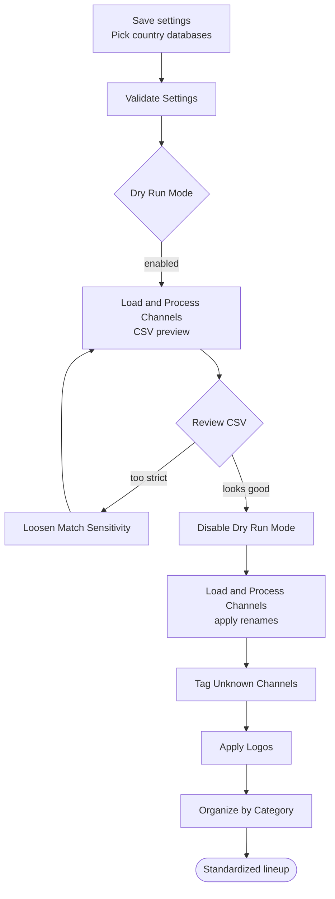

# 2. Channel Organization — Channel Mapparr

**Repository:** [Dispatcharr-Channel-Maparr-Plugin](https://github.com/PiratesIRC/Dispatcharr-Channel-Maparr-Plugin)

## Goal

Standardize the names of channels that already exist in Dispatcharr using country-specific channel databases (US, UK, CA, AU, BR, DE, ES, FR, IN, MX), and optionally re-organize them into category groups (News, Sports, Entertainment, etc.).

!!! warning
    This plugin does not create channels by default. It works on channels already in your lineup. The optional **Import M3U Streams** action can pull new streams in from an M3U source if you need it.

!!! danger "Back up your database first"
    This plugin makes bulk channel renames and group reassignments that cannot be undone. [Back up the Dispatcharr database](../prerequisites.md#back-up-the-database) before running any actions.

## Plugin Flow

## Configuration Options

- **Channel Databases:** Comma-separated 2-letter country codes (default `US`).
- **Match Sensitivity:** `strict` / `normal` / `loose` (default `normal`). Lower it to `loose` if real channels are being missed; raise to `strict` to avoid false positives.
- **Dry Run Mode:** Boolean toggle. When enabled, all rename / organize / tag actions emit a CSV preview instead of writing changes.
- **Channel Groups to Process** and **Channel Groups for Category Organization** to limit scope.
- **OTA Channel Name Format:** Template using `{NETWORK}`, `{STATE}`, `{CITY}`, `{CALLSIGN}` (default `{NETWORK} - {STATE} {CITY} ({CALLSIGN})`).
- **Ignored Tags:** Tags stripped before matching (default `[4K], [FHD], [HD], [SD], [Unknown], [Unk], [Slow], [Dead]`). Handles both `[]` and `()`.
- **Suffix for Unknown Channels:** Default `" [Unk]"` (with leading space).
- **Default Logo:** Logo display name from Dispatcharr's Logo Manager.
- **M3U Source**, **M3U Group Filter**, **Category Filter**, **Custom Import Group Name** — used by the **Import M3U Streams** action.
- **Rate Limiting:** None / Low / Medium / High. Raise it if Dispatcharr starts returning errors during long runs.

## Action Sequence

1. Save settings and select the country databases you want loaded.
2. Run **Validate Settings** to confirm configuration.
3. Enable **Dry Run Mode** and run **Load & Process Channels** to load and match channels against the selected databases. A CSV preview is exported.
4. Review the CSV. If too many channels are skipped, set **Match Sensitivity** to `loose` and re-run.
5. Disable **Dry Run Mode** and run **Load & Process Channels** again to apply standardized names.
6. Run **Tag Unknown Channels** to flag whatever did not match.
7. Optionally run **Apply Logos** for channels missing artwork.
8. For category sorting, run **Organize by Category** (with **Dry Run Mode** first to preview, then again with it disabled to commit).
9. Use **Import M3U Streams** if you need to pull streams from an M3U source, and **Clear CSV Exports** to clean up old preview files.

## Important Notes

- Use the *display name* from the Dispatcharr Logos page for **Default Logo**, not the filename.
- Always preview with **Dry Run Mode** before running rename / organize / tag actions for the first time on a profile — they touch many channels at once.
