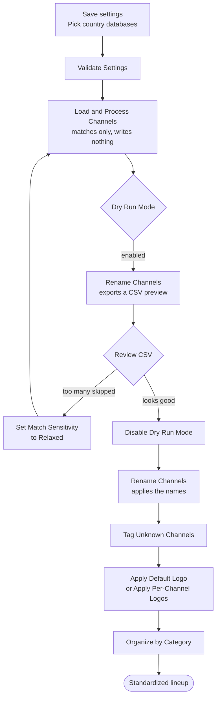
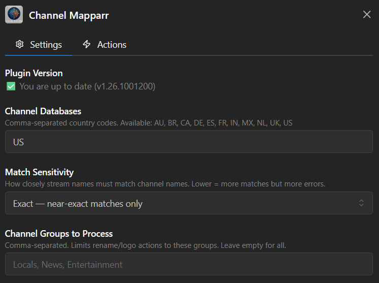
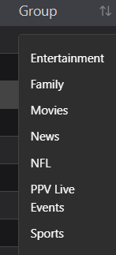

# 2. Channel Organization — Channel Mapparr

**Repository:** [Dispatcharr-Channel-Maparr-Plugin](https://github.com/PiratesIRC/Dispatcharr-Channel-Maparr-Plugin) &nbsp;  &nbsp; 

!!! info "Note the spelling"
    The repository is **Channel-Maparr** with one `p`, while the plugin displays as **Channel Mapparr**. If you are searching GitHub or the Dispatcharr plugin listing and coming up empty, that is why.

## Goal

Standardize the names of channels that already exist in Dispatcharr using country channel databases, and optionally re-organize them into category groups (News, Sports, Entertainment, and so on).

Twelve country databases ship with the plugin: **AU, BR, CA, DE, ES, FR, IN, MX, NL, NO, UK, US**.

!!! warning "This plugin does not create channels"
    It works on channels already in your lineup. The optional **Import M3U Streams** action can pull new streams in from an M3U source if you need it.

!!! danger "Back up your database first"
    This plugin makes bulk channel renames and group reassignments that cannot be undone. [Back up the Dispatcharr database](../prerequisites.md#back-up-the-database) before running any actions.

## Plugin Flow

!!! danger "Load & Process Channels does not rename anything"
    This trips people up. **Load &amp; Process Channels** only matches your channels against the databases and stores the result. Nothing is written to your lineup until you run **Rename Channels**. Earlier versions of this guide told you to run Load &amp; Process twice, which renames nothing at all.

## Configuration Options

- **Channel Databases:** Comma-separated 2-letter country codes (default `US`).
- **Match Sensitivity:** `relaxed` / `normal` (default, threshold 80) / `strict` / `exact`. Use **relaxed** if real channels are being missed, **strict** or **exact** to avoid false positives. (There is no `loose` setting — earlier versions of this guide called it that.)
- **Dry Run Mode:** See the warning below — it does **not** cover every action.
- **Channel Groups to Process** and **Category Organization Groups** to limit scope.
- **OTA Name Format:** Template using `{NETWORK}`, `{STATE}`, `{CITY}`, `{CALLSIGN}` (default `{NETWORK} - {STATE} {CITY} ({CALLSIGN})`).
- **Ignored Tags:** Tags stripped before matching (default `[4K], [FHD], [HD], [SD], [Unknown], [Unk], [Slow], [Dead]`). Handles both `[]` and `()` forms.
- **Unknown Channel Suffix:** Default `" [Unk]"` (with a leading space).
- **Default Logo:** Logo *display name* from Dispatcharr's Logo Manager, not the filename.
- **M3U Source**, **M3U Group Filter**, **Category Filter**, **Custom Import Group Name** — used by the **Import M3U Streams** action.
- **Rate Limiting:** None / Low / Medium / High. Raise it if Dispatcharr starts returning errors during long runs.

!!! danger "Dry Run Mode does not protect every action"
    **Dry Run Mode only covers Rename Channels, Organize by Category, and Import M3U Streams.**

    These three actions **write to your database immediately, even with Dry Run Mode ON**, and give you no preview:

    - **Tag Unknown Channels** — bulk-renames every unmatched channel to add the suffix.
    - **Apply Default Logo**
    - **Apply Per-Channel Logos**

    Back up before you run any of them for the first time.

## Action Sequence

1. Save settings and select the country databases you want loaded.
2. Run **Validate Settings** to confirm configuration.
3. Run **Load & Process Channels** to match your channels against the databases. This writes nothing to your lineup.
4. Enable **Dry Run Mode** and run **Rename Channels** to export a CSV preview of the proposed names.
5. Review the CSV. If too many channels are skipped, set **Match Sensitivity** to `relaxed`, re-run Load & Process, and preview again.
6. Disable **Dry Run Mode** and run **Rename Channels** to apply the standardized names.
7. Optionally run **Tag Unknown Channels** to flag whatever did not match. **This writes immediately — Dry Run does not stop it.**
8. Optionally run **Apply Default Logo** (a single fallback logo) or **Apply Per-Channel Logos** (fuzzy-matches each channel against the public tv-logos repository). **Both write immediately.**
9. For category sorting, run **Organize by Category** — with **Dry Run Mode** on first to preview, then again with it off to commit.
10. Use **Import M3U Streams** if you need to pull streams from an M3U source, **Show Status** to check on a run, and **Clear CSV Exports** to clean up old preview files.

## Important Notes

- Use the *display name* from the Dispatcharr Logos page for **Default Logo**, not the filename.
- Always preview with **Dry Run Mode** before running Rename or Organize for the first time on a profile — they touch many channels at once.
- **Over-the-air channels are matched by the callsign found in the existing channel name.** A callsign that is also an ordinary English word (KING, WHO, WOLF, WAVE, WOOD) is only accepted with corroboration, so a channel named `24/7 KING OF THE HILL` is reported as **skipped** rather than renamed into a Seattle NBC station. If you expected such a channel to be renamed and it was not, this guard is why.
