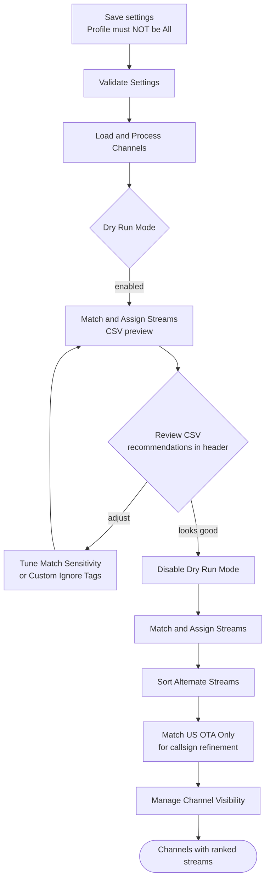

# 3. Stream Association — Stream Mapparr

**Repository:** [Stream-Mapparr](https://github.com/PiratesIRC/Stream-Mapparr) &nbsp;  &nbsp; 

## Goal

Match streams to channels via fuzzy logic, rank alternates by physical quality (resolution and FPS), prioritize preferred M3U sources, and toggle channel visibility based on whether streams are attached. Filters out dead 0x0 streams using IPTV Checker metadata and deduplicates stream names.

!!! danger "Back up your database first"
    This plugin overwrites stream assignments and toggles channel visibility in bulk. [Back up the Dispatcharr database](../prerequisites.md#back-up-the-database) before running any actions.

## Plugin Flow

## Configuration Options

- **Profile Name:** Required. Must be a Channel Profile other than "All".
- **Channel Groups:** Comma-separated; empty = all.
- **Stream Groups** and **M3U Sources** to constrain which streams are eligible for matching.
- **Channel Database:** Default `US`. Determines which country's OTA callsign rules apply.
- **Restrict Matching To Same Country:** Boolean — only match streams when the country tag matches the channel database.
- **Overwrite Existing Streams:** Replace current stream assignments (default true).
- **Match Sensitivity:** Default `Normal (80)`. Set to `Loose` if too many channels go unmatched, or `Strict` to reduce false positives.
- **Prioritize Quality:** When ranking alternates, prefer higher resolution / FPS over source-list order.
- **Filter Dead Streams:** Skip streams flagged dead by IPTV Checker.
- **Visible Channel Limit:** How many duplicate channels to keep enabled per group (default 1).
- **Custom Ignore Tags:** Tags stripped before matching.
- **Tag Handling:** How to treat tags during matching (default `Strip All`).
- **Rate Limiting:** None / Low / Medium / High. Raise it if you see 429 or 5xx errors.
- **Dry Run Mode:** Toggle to preview matches without writing changes.
- **Webhook URL** and **Fire Webhook On Completion** for external notifications.
- **Timezone** plus **Scheduled Run Times** (HHMM, comma-separated, e.g., `0400,1600`) for the built-in scheduler.

## Action Sequence

1. Save settings and select your Channel Profile (not "All").
2. Run **Validate Settings** to confirm configuration.
3. Run **Load/Process Channels** to seed the match table.
4. Enable **Dry Run Mode** and run **Match & Assign Streams** to generate a CSV in `/data/exports/` showing proposed matches. The CSV header includes recommendations such as "set Match Sensitivity to Loose" or "add a tag to Custom Ignore Tags."
5. Review the CSV.
6. Disable **Dry Run Mode** and run **Match & Assign Streams** to apply.
7. Run **Sort Alternate Streams** to re-rank backup streams attached to each channel.
8. For US over-the-air channels, run **Match US OTA Only** to refine OTA matches with callsign-aware logic.
9. Run **Manage Channel Visibility** to toggle channels based on whether streams are attached.
10. Use **Update Schedule** to save scheduler settings, and **Clear Operation Lock** if a previous run got stuck.

## Important Notes

!!! danger "Background operations"
    The frontend shows "✅ Started in background" immediately, but progress and completion only appear in Docker logs. The button re-enabling does **not** mean the task finished.

- Watch progress with: `docker logs -f dispatcharr | grep "Stream-Mapparr"`. Wait for `✅ COMPLETED` before queuing the next action.
- Operations can take 5–15+ minutes on large catalogs.
- The Channel Profile must exist and must not be "All" — the plugin will refuse to run otherwise.
- To stop a runaway operation, restart the container: `docker restart dispatcharr`. The operation lock expires after 10 minutes on its own, or you can clear it manually with **Clear Operation Lock**.
