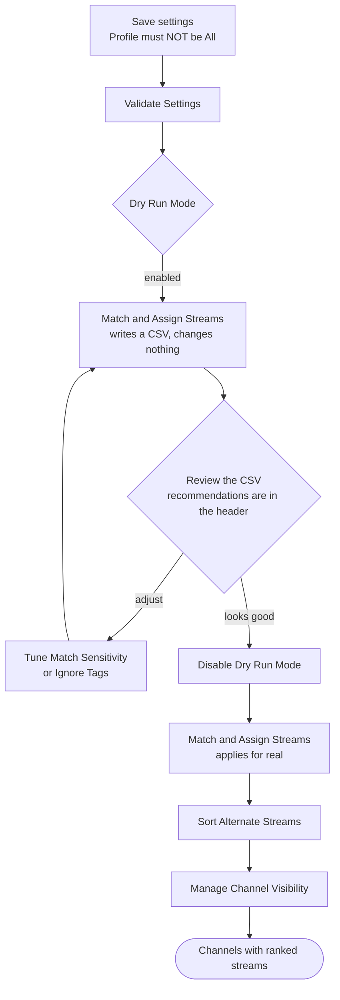
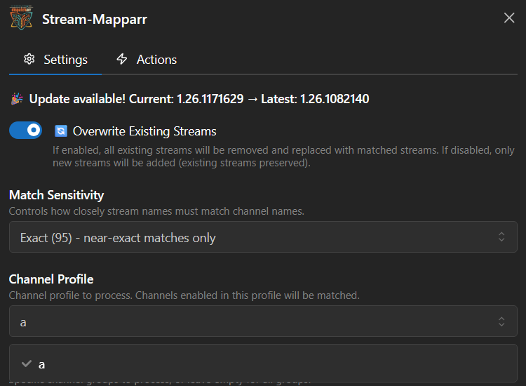

# 3. Stream Association: Stream-Mapparr

**Repository:** [Stream-Mapparr](https://github.com/PiratesIRC/Stream-Mapparr) &nbsp;  &nbsp; 

## Goal

Match streams to channels by name, attach the best stream to each channel, and rank the alternates behind it so failover has good backups to fall through to. US over-the-air channels are matched by their FCC callsign. The plugin can also toggle channel visibility based on whether a channel ended up with any streams.

!!! danger "Match & Assign REPLACES a channel's stream list. Read this before your first run."
    With **Overwrite Existing Streams** on (the default), Match &amp; Assign does not add to a channel's streams. For every channel it matches, it **deletes all existing stream assignments and rebuilds the list from only the streams it matched in this run**.

    The streams it matched are limited by your current **M3U Sources**, **Stream Groups** and **Channel Groups** selection. So if you narrow **M3U Sources** to one provider and run it, every stream on those channels that came from your *other* providers is deleted and not put back. Your failover backups go with it.

    - Only narrow M3U Sources if you actually intend to drop the other providers' streams from those channels.
    - Set **Overwrite Existing Streams** to `false` to append instead of replace.
    - A channel whose group matched **zero** streams is left untouched, so an over-tight filter blanks nothing. It just quietly does nothing.
    - **📡 Match US OTA Only** replaces stream lists in exactly the same way.

    [Back up the Dispatcharr database](../prerequisites.md#back-up-the-database) before your first apply.

## Plugin Flow

!!! note "There is no 'Load / Process Channels' button any more"
    Earlier versions of this guide told you to run it first. It is gone from the UI. Match &amp; Assign (and its dry run) load and process the channels themselves, so just run Match &amp; Assign.

## Configuration Options

### Scope: what is eligible to match

- **Profile Name:** Required. Must be a Channel Profile other than "All".
- **Channel Groups:** Comma-separated; empty = all.
- **Stream Groups** and **M3U Sources** constrain which streams are eligible. **The order of M3U Sources matters**: streams from sources listed earlier win when ranking. Read the danger note above before narrowing either field.
- **Channel Database:** Default `US`. Supplies the channel list and the OTA callsign rules.
- **Restrict Matching To Same Country:** Only match streams whose detected country matches the channel database. Useful on multi-country M3Us.

### Matching

- **Match Sensitivity:** `Relaxed (70)` / `Normal (80)` (default) / `Strict (90)` / `Exact (95)`. Use **Relaxed** if too many channels go unmatched, **Strict** to cut false positives. (There is no "Loose" option: older versions of this guide called it that.)
- **Tag Handling:** How tags are treated when comparing names (default `Strip All`).
- **Ignore Tags (comma-separated):** Extra tags stripped from names before matching.
- **Custom Aliases:** A JSON object of extra `"Channel": ["Alias", …]` mappings, merged with the built-in alias table. An exact alias hit is force-matched. This is the escape hatch when a channel simply will not match by name.
- **Overwrite Existing Streams:** Default **true**. True means *replace*, not *add*: see the danger note.
- **Visible Channel Limit:** How many duplicate channels to enable per group (default 1).
- **Filter Dead Streams:** Skip streams IPTV Checker flagged as dead (0x0 resolution). **Off by default**, so turn it on if you want it.

### Ranking the alternate streams

Sorting decides which stream plays first and which ones failover falls back to. The full order is:

**throughput tier → M3U source order (or quality, if _Prioritize Quality_ is on) → audio channels → audio codec → resolution → FPS**

- **Prioritize Quality:** Rank by resolution and FPS ahead of M3U source order.
- **Enable Throughput Sorting:** Default **true**. Puts a measured-bandwidth tier ahead of everything else. It only does anything once you have run **🚀 Probe Stream Throughput**: with an empty cache every stream is "unknown" and the tier collapses to a no-op.
- **Audio Channels Priority** / **Audio Codec Priority:** Ordered lists, best first (for example `5.1, stereo`). Ranked *before* resolution. Empty = off.

### Throughput probing

**🚀 Probe Stream Throughput** opens short connections to the streams currently attached to your channels and measures real delivered bandwidth, so Sort can rank by what actually works rather than by advertised resolution.

- **Probe Duration Seconds** (8), **Probe Cache TTL Minutes** (30), **Probe Rate Per Minute** (6), **Bitrate Safety Margin** (1.10).
- Probes are serialized per M3U account with a one second gap between them, because providers usually cap concurrent connections.

!!! warning "Probing consumes a provider connection"
    A probe opens a real connection to your provider. If your provider allows only a small number of concurrent connections, probing while somebody is watching can interrupt their stream. Probe when the house is quiet.

### Scheduling and automation

- **Scheduled Run Times:** Comma-separated, **`HHMM` only**: for example `0400,1600`. A value like `04:00` is silently ignored. Times follow **Dispatcharr's global Time Zone** (Settings → General). This plugin no longer has a Timezone setting of its own.
- **Scheduled: Match Streams** (default on) and **Scheduled: Sort Streams** (default off) decide what a scheduled slot actually does.
- **Auto-match after M3U refresh:** Opt-in, default **off**. Runs Match &amp; Assign automatically each time an M3U refresh finishes. Requires Dispatcharr v0.27+ and a Profile to be selected.

    !!! warning "This automates the replace-the-stream-list behaviour"
        With this on, the rebuild described in the danger note runs unattended after every refresh. Only enable it once you are happy with what a manual run produces.

- **Wait For IPTV Checker** and **IPTV Checker Max Wait Hours** (6): a scheduled run can block for hours waiting for IPTV Checker to finish first.
- **Enable Scheduled CSV Export:** Also write a CSV on scheduled runs.

    !!! warning "On versions before 1.26.2241602, check that your schedule is actually firing"
        The scheduler read its run times from a settings file written by the plugin page, and that file could fall out of step with what the plugin had actually saved. When it did, the plugin logged `No scheduled times configured` and simply never ran, while the settings page kept showing your configured times. Nothing errored, so there was no signal that anything was wrong.

        Version **1.26.2241602** reconciles the file against the saved settings at startup and rewrites it. If you are on an older build, upgrade. Either way, **confirm a scheduled run by its side effects**, a new CSV export or a fresh entry in **📋 View Last Results**, rather than by the times shown on the settings page.
- **Rate Limiting:** None / Low / Medium / High. Raise it if you see 429 or 5xx errors.
- **Webhook URL** and **Fire Webhook On Completion:** Discord and Slack URLs are given their native message format automatically.

## Action Sequence

1. Save settings and select your Channel Profile (not "All").
2. Run **✅ Validate Settings**.
3. Enable **Dry Run Mode** and run **✅ Match &amp; Assign Streams**. Nothing is written; a CSV lands in `/data/exports/` showing what it *would* do. The CSV header carries tuning recommendations, such as setting Match Sensitivity to Relaxed or adding a tag to Ignore Tags.
4. Review the CSV. Adjust and repeat until it looks right.
5. Disable **Dry Run Mode** and run **✅ Match &amp; Assign Streams** to apply.
6. Optionally run **🚀 Probe Stream Throughput** to measure real bandwidth.
7. Run **🔄 Sort Alternate Streams** to re-rank the backups on each channel.
8. Run **👁️ Manage Channel Visibility** to enable or disable channels based on whether they have streams.

!!! warning "Manage Channel Visibility disables everything first"
    It **disables every channel in the profile**, then re-enables only those with at least one stream attached. A channel you deliberately keep enabled with no streams will be switched off.

**US over-the-air channels are handled automatically.** Callsign matching runs inside Match &amp; Assign, so you do not need a separate pass. **📡 Match US OTA Only** is there for when you want to redo *only* the OTA channels; it replaces stream lists exactly as Match &amp; Assign does.

### The other buttons

- **📊 View Check Progress**: live progress of the run in flight.
- **📋 View Last Results**: summary of the last completed run.
- **💾 Update Schedule**: save scheduler settings.
- **🗑️ Clear CSV Exports**: delete old CSVs from `/data/exports/`.
- **🧹 Cleanup Orphaned Tasks** and **🔓 Clear Operation Lock**: recovery if a previous run got stuck.
- **📊 Preview**: generates a CSV preview without making changes. Use it when you want a preview without switching Dry Run Mode on and back off again.
- **🧠 Test Rules**: shows what your Stream Name Regex Rules would do across all streams, read-only. Check a new rule here before it touches a matching run.
- **🌍 Check Countries**: compares each stream's group country against the country suffix on its EPG identifier and reports where the two disagree. It reads two database columns, opens no provider connection and changes nothing, so it is safe to run at any time. Useful when a channel keeps matching a foreign feed.

## Important Notes

!!! warning "Long runs report in the UI, not just the logs"
    Short jobs run inline and return their real result. Longer jobs run in the background: the button re-enables immediately, which does **not** mean the job finished. Watch **📊 View Check Progress**, and read **📋 View Last Results** when it is done.

- Docker logs still work if you prefer them: `docker logs -f dispatcharr | grep "Stream-Mapparr"`. Wait for `✅ COMPLETED` before queuing the next action.
- Operations can take 5–15+ minutes on large catalogs.
- The Channel Profile must exist and must not be "All". The plugin refuses to run otherwise.
- Only one long-running action runs at a time. The operation lock expires after 10 minutes by itself, or clear it with **🔓 Clear Operation Lock**.
- **East and West feeds are routed automatically.** If you have both `Starz Encore` and `STARZ Encore (W)`, each is given its own zone's feed as the primary stream.
- **Common-word callsigns are guarded.** A stream called `24/7 KING OF THE HILL` will not be attached to the Seattle NBC station `KING-TV` just because the word "KING" appears. A callsign that is also an ordinary English word (KING, WHO, WOLF, WAVE, WOOD) has to be corroborated by the station's network or city before it counts.
