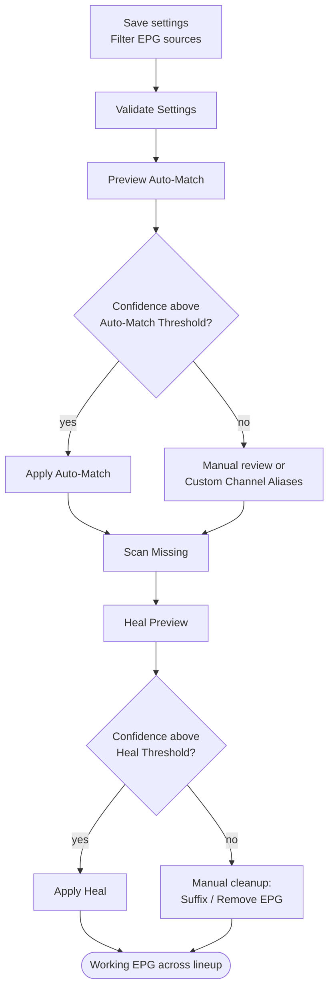
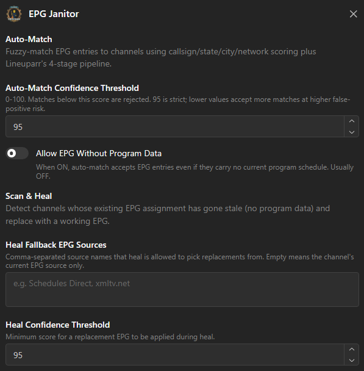

# 4. EPG Maintenance — EPG-Janitor

**Repository:** [Dispatcharr-EPG-Janitor-Plugin](https://github.com/PiratesIRC/Dispatcharr-EPG-Janitor-Plugin) &nbsp;  &nbsp; 

## Goal

Find channels that have an EPG source assigned but no actual program data — the "No Program Information Available" state in your TV guide — and either assign new EPG sources (Auto-Match) or replace broken assignments with working alternatives (Scan &amp; Heal).

This is EPG data-quality cleanup, not database size optimization.

!!! danger "Back up your database first"
    Bulk EPG assignment and removal cannot be undone. [Back up the Dispatcharr database](../prerequisites.md#back-up-the-database) before running any destructive actions.

## How a match is scored

A channel is matched to an EPG entry by whichever of two methods scores higher:

- **Structural scoring** — callsign 50 points, state 30, city 20, network 10. Two catches worth knowing: **city only scores if the state already matched**, and **network only counts as a tie-breaker**, never on its own.
- **Name matching** — the same fuzzy name engine the other plugins use, including your aliases, scoring 85–100.

The higher of the two wins, capped at 100.

!!! warning "Why the default threshold rejects callsign-only matches"
    With the default threshold of **95**, a channel that matches on callsign alone scores 50 and is **rejected**. Getting there on structure alone effectively needs callsign + state + city. Most successful matches come from the name side. If almost nothing is matching, this is usually why — and **Custom Channel Aliases** is the fix.

## Plugin Flow

## Configuration Options

- **Channel Profile Names:** Comma-separated.
- **EPG Sources to Match:** A **name filter, not a priority list**. It supports `*` and `?` wildcards (for example `UK*`). Priority comes from **Dispatcharr's own EPG source priority**, not from the order you type here.

    !!! warning "Leave it empty at your peril"
        Empty means *every active EPG source is eligible*, including sources for other countries. On a multi-region install that is a reliable way to get wrong matches. Scope it.

- **Hours to Check Ahead:** Default 12. There is no enforced range.
- **Channel Groups** and **Ignore Groups** — these are **not** mutually exclusive. Both can be set, Ignore Groups is applied after Channel Groups, and both support `*` / `?` wildcards.
- **EPG Name REGEX to Remove**, **Bad EPG Suffix** (default `" [BadEPG]"` with a leading space), **Also Remove EPG When Adding Suffix**.
- **Auto-Match Confidence Threshold** (default 95) — minimum score before Auto-Match assigns automatically.
- **Heal Fallback EPG Sources** — if set, this **replaces** the main source list for the heal pass. It is an override, not an additional last resort. Leave it empty and heal reuses **EPG Sources to Match**.
- **Heal Confidence Threshold** (default 95) — minimum score before Scan &amp; Heal swaps in a replacement.
- **Allow EPG Without Program Data:** Boolean, default false. See below.
- **Custom Channel Aliases (JSON):** Manual overrides for channels whose name matches no EPG entry. This is your main tool when a channel refuses to match.
- **Fuzzy matching toggles:** Ignore Quality Tags, Regional Tags, Geographic Prefixes, Miscellaneous Tags (all on by default).

!!! tip "Auto-Match matched nothing against a brand-new EPG source? Turn Allow EPG Without Program Data ON — once."
    Dispatcharr only imports program data for EPG entries that are already mapped to a channel. So a freshly added EPG source starts with **zero** programs, every candidate gets rejected for having no program data, and Auto-Match appears to do nothing.

    The sequence is: turn this setting **on**, run Auto-Match to assign the EPG IDs, refresh the EPG source so Dispatcharr backfills the program data, then turn it **back off**. Leaving it on permanently is what re-introduces "No Program Information Available".

## Action Sequence

1. Save settings and run **✅ Validate Settings** to confirm profile names, group names, and EPG source names.
2. Run **👁️ Preview Auto-Match** to see what EPG would be assigned, with confidence scores. Review the CSV.
3. Run **🎯 Apply Auto-Match** to assign EPG sources at or above the Auto-Match threshold.
4. Run **🔍 Scan Missing** to find channels still showing "No Program Information Available".
5. Run **🧹 Heal Preview** to preview replacements for broken EPG.
6. Run **🧹 Apply Heal** to swap broken EPG for working alternatives at or above the Heal threshold.
7. Use **🏷️ Suffix Bad EPG**, **❌ Remove Bad EPG**, **❌ Remove by REGEX**, or **❌ Remove All in Groups** for manual cleanup.
8. Use **📊 Status / Results**, **📄 Export CSV**, or **🗑️ Clear Exports** to manage output.

!!! danger "🙈 Strip Hidden EPG deletes program data, and 'hidden' is not what you think"
    Two separate traps in one button.

    **It deletes program data, not just the assignment.** For every channel it touches it deletes **all program rows belonging to that EPG entry**. If a *visible* channel is mapped to the same EPG entry, that channel's guide goes blank too, until your next EPG refresh.

    **"Hidden" means disabled in *any one* of the profiles you listed** — not "hidden everywhere". A channel that is enabled in profile A but disabled in profile B is treated as hidden and stripped. If you list several profiles, this will bite you. List one.

## Important Notes

- **Auto-Match vs. Scan &amp; Heal:** Auto-Match is for initial setup and bulk assignment. Scan &amp; Heal is for repairing EPG that used to work and broke. Run Auto-Match first, then re-run Scan &amp; Heal periodically.
- **There is no scheduler in this plugin.** Every action is triggered by hand. Earlier versions of this guide suggested scheduling periodic Scan &amp; Heal runs — you cannot, from inside the plugin.
- Scan &amp; Heal CSV status codes:
    - `HEALED` — a replacement was applied.
    - `SKIPPED_LOW_CONFIDENCE` — a replacement was found but scored below the Heal threshold, so nothing was changed.
    - `REPLACEMENT_PREVIEW` — dry-run only: this is what *would* be applied.
    - `NO_REPLACEMENT_FOUND` — no working alternative in your configured sources.
- EPG removal and renaming are permanent. All destructive actions require confirmation.
