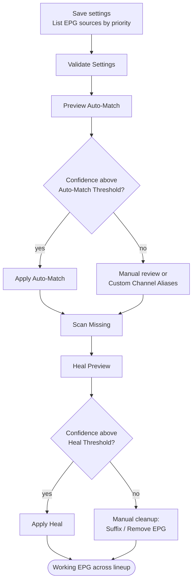

# 4. EPG Maintenance — EPG Janitor

**Repository:** [Dispatcharr-EPG-Janitor-Plugin](https://github.com/PiratesIRC/Dispatcharr-EPG-Janitor-Plugin) &nbsp;  &nbsp; 

## Goal

Find channels that have an EPG source assigned but no actual program data — the "No Program Information Available" state in your TV guide — and either assign new EPG sources (Auto-Match) or replace broken assignments with working alternatives (Scan & Heal).

Both features use the same weighted scoring system: callsign 50 points, state 30, city 20, network 10, plus program data validation. This is EPG data-quality cleanup, not database size optimization.

!!! danger "Back up your database first"
    Bulk EPG assignment and removal cannot be undone. [Back up the Dispatcharr database](../prerequisites.md#back-up-the-database) before running any destructive actions.

## Plugin Flow

## Configuration Options

- **Channel Profile Names:** Comma-separated; channels visible in any of the listed profiles are included.
- **EPG Sources to Match:** Ordered by priority (first = highest). Source names are validated and typos trigger warnings.
- **Hours to Check Ahead:** 1–168, default 12.
- **Channel Groups** *or* **Ignore Groups** — these are mutually exclusive.
- **EPG Name REGEX to Remove**, **Bad EPG Suffix** (default `" [BadEPG]"` with leading space), **Also Remove EPG When Adding Suffix**.
- **Auto-Match Confidence Threshold** (default 95) — minimum score required before Auto-Match assigns an EPG source automatically.
- **Heal Fallback EPG Sources** — additional sources tried only by Scan & Heal when the primary list cannot supply program data.
- **Heal Confidence Threshold** (default 95) — minimum score required before Scan & Heal swaps in a replacement automatically.
- **Allow EPG Without Program Data:** Boolean (default false). Off prevents assignment of empty EPG sources, which is the main defense against re-introducing the "No Program Information Available" state.
- **Custom Channel Aliases (JSON):** Manual overrides for channels whose name does not match any EPG entry by fuzzy logic.
- **Fuzzy matching toggles:** Ignore Quality Tags, Regional Tags, Geographic Prefixes, and Miscellaneous Tags (all on by default).

## Action Sequence

1. Save settings and run **✅ Validate Settings** to confirm profile names, group names, and EPG source names.
2. Run **👁️ Preview Auto-Match** to see what EPG would be assigned, with confidence scores. Review the CSV.
3. Run **🎯 Apply Auto-Match** to assign validated EPG sources at or above the Auto-Match threshold.
4. Run **🔍 Scan Missing** to find any channels still showing "No Program Information Available."
5. Run **🧹 Heal Preview** to preview replacements for broken EPG. Confidence scores are in the CSV.
6. Run **🧹 Apply Heal** to swap broken EPG for working alternatives at or above the Heal threshold.
7. Use **🏷️ Suffix Bad EPG**, **❌ Remove Bad EPG**, **❌ Remove by REGEX**, or **❌ Remove All in Groups** for manual cleanup.
8. Use **👁️‍🗨️ Strip Hidden EPG** to drop EPG assignments from channels that are not visible in any configured profile.
9. Use **📊 View Last Results**, **📄 Export CSV**, or **🗑️ Clear Exports** to manage CSV output.

## Important Notes

- **Auto-Match vs. Scan & Heal:** Auto-Match is for initial setup or bulk assignment. Scan & Heal is for ongoing repair when previously-working EPG breaks. Use Auto-Match first, then schedule periodic Scan & Heal runs for maintenance.
- Only EPG sources that actually have program data in the time window are assigned (when **Allow EPG Without Program Data** is off). Empty sources are skipped, which prevents the "No Program Information Available" problem from coming back through a bad assignment.
- Scan & Heal CSV status codes:
    - `HEALED` — applied
    - `REPLACEMENT_PREVIEW` — below threshold, needs manual review
    - `NO_REPLACEMENT_FOUND` — no working alternative in your configured sources
- EPG removal and renaming are permanent. All destructive actions require confirmation.
