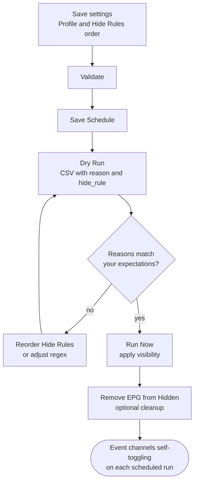

# Bonus: Live Events — Event Channel Managarr

**Repository:** [Dispatcharr-Event-Channel-Managarr-Plugin](https://github.com/PiratesIRC/Dispatcharr-Event-Channel-Managarr-Plugin)

## Goal

Automatically toggle the visibility of existing event-style channels (PPV, sports, F1, fight nights) based on EPG data and channel name patterns. The plugin hides channels that currently have no event and shows ones that do, using a prioritized rule list.

!!! warning
    The plugin does not create new channels from keywords. The channels must already exist in your lineup, typically from event-style M3U entries.

!!! danger "Back up your database first"
    Channel visibility changes and bulk EPG removal cannot be undone. [Back up the Dispatcharr database](../prerequisites.md#back-up-the-database) before running any actions.

## Plugin Flow



## Configuration Options

- **Timezone** for scheduled runs.
- **Channel Profile Names** (required, comma-separated for multiple profiles).
- **Channel Groups** to narrow scope.
- **Name Source:** `Channel_Name` or `Stream_Name` for rule matching.
- **Channel Name Event Timezone:** Default `US/Eastern`. Used when extracting times from channel names that include a clock value.
- **Event Duration:** How long an event keeps a channel visible after its start time (default 3 hours).
- **Manage Dummy EPG:** Default false. When enabled, the plugin can attach or detach dummy EPG entries on hidden channels for cleaner guide rendering.
- **Hide Rules Priority:** Ordered, comma-separated list. Default:
  ```
  [InactiveRegex],[BlankName],[WrongDayOfWeek],[NoEventPattern],
  [EmptyPlaceholder],[PastDate:0],[FutureDate:2],[UndatedAge:2],
  [ShortDescription],[ShortChannelName]
  ```
  Other available rules: `[NoEPG]`, `[NumberOnly]`, `[PastDate:days:Xh]` and `[FutureDate:days]` (inline parameters), `[UndatedAge:days]`.
- **Regex: Channel Names to Ignore / Mark Channel as Inactive / Force Visible Channels.**
- **Duplicate Handling Strategy:** `lowest_number` / `highest_number` / `longest_name`, plus a **Keep Duplicate Channels** override.
- **Past Date Grace Period (Hours):** Default 4.
- **Auto-Remove EPG on Hide:** Default true.
- **Rate Limiting:** None / Low / Medium / High.
- **Scheduled Run Times** (HHMM, comma-separated) and **Enable Scheduled CSV Export**.

!!! info "📸 Screenshot suggestion"
    **File:** `screenshots/event-channel-managarr-hide-rules.png`
    **Show:** the **Hide Rules Priority** field with the default order, and the three regex fields below it. Rule ordering is the central concept of the plugin and worth a clear picture.

## Action Sequence

1. Save settings and the required Channel Profile name(s).
2. Run **🔎 Validate** to confirm profile names, group names, and regex patterns parse correctly.
3. Adjust **Hide Rules Priority** if the default order does not fit your event channels.
4. Click **💾 Save Schedule** to save settings and activate any scheduled run times.
5. Run **👁️ Dry Run** and review the `reason` and `hide_rule` columns to confirm the right channels would be hidden or shown.
6. Run **▶️ Run Now** to apply visibility changes immediately.
7. Optionally run **🧹 Remove EPG from Hidden** to keep the guide clean.
8. Use **🩺 Check Scheduler** to verify scheduled runs are registered, **🧼 Cleanup Orphaned Tasks** to clear stale Celery entries, and **🗑️ Clear CSV Exports** to remove old preview files.

!!! info "📸 Screenshot suggestion"
    **File:** `screenshots/event-channel-managarr-dry-run.png`
    **Show:** an excerpt of the Dry Run CSV with `channel_name`, `action` (hide / show), `reason`, and `hide_rule` columns visible. The `hide_rule` column is what tells you which rule fired — central to debugging unexpected results.

## Important Notes

- Each scan covers all channels in the profile — visible and hidden — so a channel that picks up a new event will be re-shown automatically on the next run.
- The first matching rule in the priority list wins. Subsequent rules are not evaluated for that channel.
- The **Force Visible** regex always wins over hide rules. Useful for keeping news, weather, or always-on channels visible.
- Date extraction supports many formats (`Nov 8 16:00`, `12/25/2024`, `start:2024-12-25 20:00:00`, ISO formats, ordinal dates, and more). The grace period prevents premature hiding of events that run past midnight.

!!! info "📸 Screenshot suggestion"
    **File:** `screenshots/event-channel-managarr-before-after.png`
    **Show:** the Dispatcharr Channels page filtered to your event group, before a Run Now (mostly hidden, one or two visible) and after (only currently-active events visible). Best demonstration of the plugin's value.
