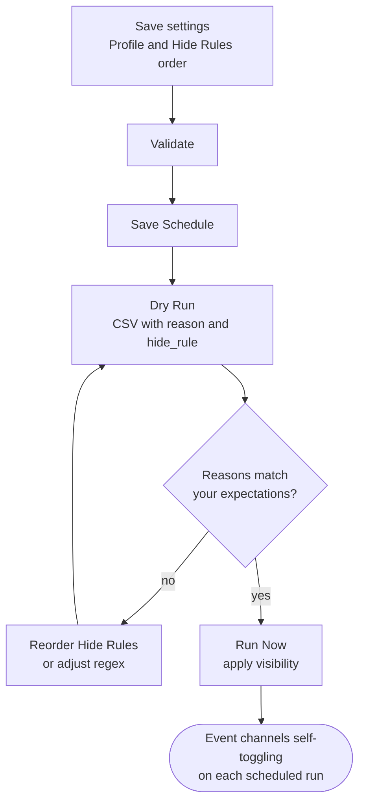

# Bonus: Live Events with Event Channel Managarr

**Repository:** [Dispatcharr-Event-Channel-Managarr-Plugin](https://github.com/PiratesIRC/Dispatcharr-Event-Channel-Managarr-Plugin) &nbsp; [](https://deepwiki.com/PiratesIRC/Dispatcharr-Event-Channel-Managarr-Plugin) &nbsp; [](https://discord.gg/Sp45V5BcxU)

## Goal

Automatically toggle the visibility of existing event-style channels (PPV, sports, F1, fight nights) based on EPG data and channel name patterns. The plugin hides channels that currently have no event and shows the ones that do, using a prioritized rule list.

!!! warning "The plugin does not create channels"
    The channels must already exist in your lineup, typically from event-style M3U entries. The plugin only shows and hides them.

!!! danger "Back up your database first"
    Channel visibility changes and bulk EPG removal cannot be undone. [Back up the Dispatcharr database](../prerequisites.md#back-up-the-database) before running any actions.

## Plugin Flow



## Configuration Options

- **Channel Profile Names** (required, comma-separated for multiple profiles).
- **Channel Groups** to narrow scope.
- **Name Source:** `Channel_Name` or `Stream_Name` for rule matching.
- **Date Format in Channel Names:** `Auto` (default) / US (MM/DD) / EU (DD/MM). This decides how a date in a channel name is read, so **non-US users should check it**: get it wrong and the date rules hide the wrong channels.
- **Channel Name Event Timezone:** Default `US/Eastern`. Used when extracting a clock time from a channel name.
- **Event Duration:** How long an event keeps a channel visible after its start time (default 3 hours).
- **Hide Rules Priority:** Ordered, comma-separated list. Default:
  ```
  [InactiveRegex],[BlankName],[WrongDayOfWeek],[NoEventPattern],
  [EmptyPlaceholder],[PastDate:0],[FutureDate:2],[UndatedAge:2],
  [ShortDescription],[ShortChannelName]
  ```
  Also available: `[NoEPG]`, `[NumberOnly]`, `[PastDate:days]`, `[PastDate:days:Xh]`, `[FutureDate:days]`, `[UndatedAge:days]`, `[InactiveRegex]`.
- **Regex: Channel Names to Ignore / Mark Channel as Inactive / Force Visible Channels.**
- **Duplicate Handling Strategy:** `lowest_number` / `highest_number` / `longest_name`, plus a **Keep Duplicate Channels** override.
- **Past Date Grace Period (Hours):** Default 4.
- **Auto-Remove EPG on Hide:** Default true. This *clears* EPG from channels as they are hidden. It does not create anything.
- **Rate Limiting:** None / Low / Medium / High.
- **Scheduled Run Times** (`HHMM`, comma-separated) and **Enable Scheduled CSV Export**. Scheduled runs and all date/day rules follow **Dispatcharr's global Time Zone** (Settings → General); if that is unset they fall back to UTC. This plugin no longer has a Timezone setting of its own.

### Managed dummy EPG

- **Manage Dummy EPG:** Default false. When enabled, **visible channels that have no EPG assigned** are bound to a plugin-managed dummy EPG source, so the guide shows something useful instead of a blank cell.

    !!! note "This is the setting that CREATES guide data"
        Not *Auto-Remove EPG on Hide*, which only clears it. Earlier versions of this guide described Manage Dummy EPG as attaching entries to *hidden* channels. It is the opposite: it applies to **visible** channels that are missing EPG.

    The guide then shows the event title during its window, `Upcoming at <time>: <title>` before it, and `Ended at <time>: <title>` after it. Turning the setting off detaches the managed EPG cleanly.

- **Override Empty Existing EPG:** Default false. Lets the managed dummy take over channels that are linked to a real EPG source which has no programmes.
- **Channel Name Format:** `US` (default) or `SE` (pipe-delimited). If your provider uses the SE format and this is wrong, dummy EPG parses nothing.

#### Channels in more than one timezone

Dispatcharr stores the dummy EPG timezone **on the EPG source**, and reads it once per source with no per-channel override. So if some of your event channels are labelled in one timezone and others in another, a single dummy source cannot serve them both: whichever timezone you pick, the other set renders hours out.

The plugin handles this by provisioning more than one managed dummy source and routing each channel to the right one by its name. You do not configure this and there is nothing to switch on. Two routes exist:

- The **default route** covers names beginning with a slot label such as `PPV 12`, `LIVE EVENT 04` or `EVENT 7`. Its source timezone is the **Channel Name Event Timezone** setting, so this is the one that setting controls.
- A **second route** covers names that begin with `Next |` or `End |` and carry `(GMT)`, the shape DAZN uses. Its timezone is always UTC, because the provider stamps the zone into the name, so the Channel Name Event Timezone setting does not apply to it.

Times are rendered into **Dispatcharr's own timezone** (Settings, General) whatever the source zone was, so both sets read correctly in your guide.

!!! note "If your provider does not use either naming shape, nothing changes"
    A channel claimed by no specific route stays with the default managed source, exactly as before. The second route only activates for names matching that pattern, so most installs will never see it. The `SE` channel name format is separate from this and is still controlled entirely by **Channel Name Format** above.

!!! warning "Changing a channel's name can move it between sources"
    Routing is decided by the channel name. If a rename makes a channel match a different route, the plugin moves it to that route's source on the next run and cleans up the binding it left behind. That is intended, but it does mean a bulk rename from another plugin can shuffle which dummy source your event channels sit on.

### Auto-rescan after M3U refresh

- **Auto-rescan after M3U refresh:** Default false. Re-runs the scan as soon as an M3U refresh completes.

!!! warning "If your hidden channels keep coming back, this is why"
    Dispatcharr's **Auto Channel Sync** re-enables every channel in a synced group on each M3U refresh, silently undoing this plugin's work. Turning **Auto-rescan after M3U refresh** on re-hides them immediately after the refresh. This is the single most common "my event channels un-hid themselves" complaint.

## Action Sequence

1. Save settings and the required Channel Profile name(s).
2. Run **🔎 Validate** to confirm profile names, group names, and regex patterns parse correctly.
3. Adjust **Hide Rules Priority** if the default order does not fit your event channels.
4. Click **💾 Save Schedule** to save settings and activate any scheduled run times.
5. Run **👁️ Dry Run** and review the `reason` and `hide_rule` columns to confirm the right channels would be hidden or shown. A dry run is a pure preview: it never creates the managed dummy EPG source and never writes an EPG binding, so it is safe to run with Manage Dummy EPG enabled.
6. Run **▶️ Run Now** to apply visibility changes immediately.
7. Optionally run **🧹 Remove EPG from Hidden** to keep the guide clean.
8. Use **🩺 Check Scheduler** to verify scheduled runs are registered, **🧼 Cleanup Orphaned Tasks** to clear stale Celery entries, and **🗑️ Clear CSV Exports** to remove old preview files.

## Important Notes

- Each scan covers all channels in the profile (visible and hidden), so a channel that picks up a new event is re-shown automatically on the next run.
- The first matching rule in the priority list wins. Later rules are not evaluated for that channel.
- The **Force Visible** regex always beats the hide rules. Useful for news, weather, or always-on channels.
- **Date and time extraction is smarter than a calendar day.** With a `stop:` timestamp in the name, the real end time is used. With a clock time, the end is taken as start + **Event Duration**, in the Channel Name Event Timezone. Only names carrying a bare date fall back to calendar day plus the grace period.
- **Run order matters:** Stream-Mapparr's *Manage Channel Visibility* also toggles channel visibility and will happily undo this plugin's work. See [Scheduling and run order](../scheduling.md).
